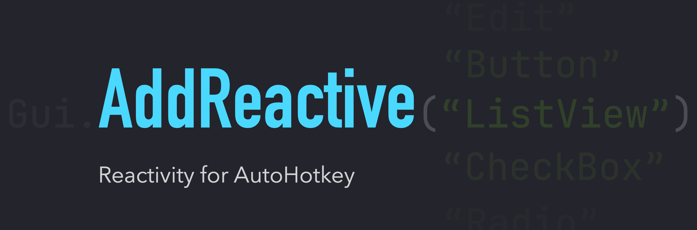

<br>

AddReactive is a reactive GUI control library for AutoHotkey v2, inspired by modern frontend frameworks. 
Building dynamic and responsive desktop applications with ease, bringing reactivity to AutoHotkey's GUI capabilities.

## At a Glance


<!--  use gif here -->
```go
#Include "./AddReactive/useAddReactive.ahk"

myApp := Gui(, "Reactivity")
Counter(myApp)
myApp.Show()

// Use function as a component.
Counter(App) {
    // Create piece of reactive data by using signal.
    count := signal(1)
    
    // To create a derived signal, use computed and pass a computation function
    doubleCount := computed(count, curCount => curCount * 2)

    // Use effect to create a side-effect function that runs when depend changes.
    effect(count, curCount => MsgBox("Count changed! current:" . curCount))

    return (
        App.AddText("w150 h30", "Show case"),
        
        // Use AddReactive Controls with formatted string to show reactive data.
        App.ARText("y+10", "Count: {1}", count),
        App.ARText("y+10", "Doubled: {2}", doubleCount),
        
        // Updating the value of signal by its setter.
        App.AddButton("y+10 w80 h30", "Increase")
           .OnEvent("Click", (*) => count.set(c => c + 1))
    )
}
```