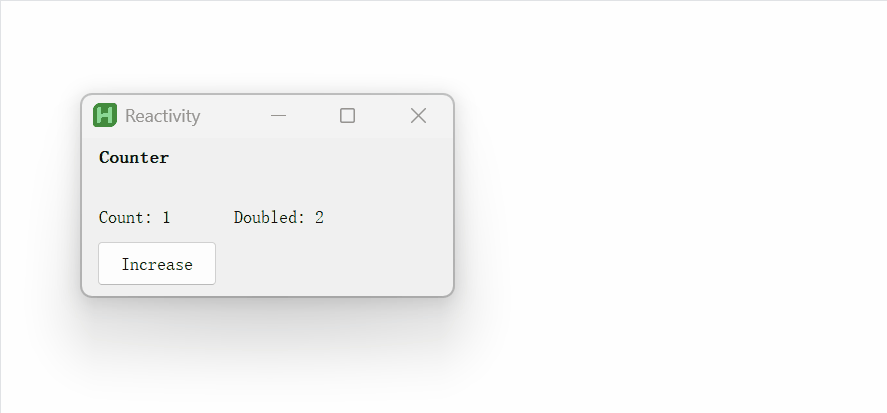

AddReactive is a reactive GUI control library for AutoHotkey v2, inspired by modern frontend frameworks.
Building dynamic and responsive desktop applications with ease, bringing reactivity to AutoHotkey's GUI capabilities.

<br>

## Key Features

-   **Reactive Bindings**: Sync controls with reactive data.
-   **Declarative Syntax**: Define UI in a clear and concise manner.
-   **Component-Based Architecture**: Build reusable and modular GUI components.
-   **Extension Methods**: Adds enhance methods to built-in types like `Gui`, `Array`, `String` and `Map`.

<br>

## At a Glance



```c++
#Include "./AddReactive/useAddReactive.ahk"
#SingleInstance Force

myApp := Gui(, "Reactivity")
Counter(myApp)
myApp.Show()

/* Use function as a component. */
Counter(App) {
    /* Create piece of reactive data by using signal. */
    count := signal(1)

    /* To create a derived signal, use computed and pass a computation function */
    doubleCount := computed(count, curCount => curCount * 2)

    /* Use effect to create a side-effect function that runs when depend changes. */
    effect(count, curCount => MsgBox("Count changed! current:" . curCount, "Counter", "T2"))

    return (
        App.AddText("w150 h30", "Counter").SetFont("Bold"),

        /*  Use AddReactive Controls with formatted string to show reactive data. */
        App.ARText("w80 y+10", "Count: {1}", count),
        App.ARText("w80 x+10", "Doubled: {1}", doubleCount),

        /* Updating the value of signal by its setter. */
        App.AddButton("x10 y+10 w80 h30", "Increase")
           .OnEvent("Click", (*) => count.set(c => c + 1))
    )

}
```

<br>

## More Examples

### Stateful Component

Create stateful component by using `Component` for more features like controlled showing, scoped submit and more.

<details>
<summary>Show More</summary>

```c++
#SingleInstance Force
#Include "../useAddReactive.ahk"

oGui := Gui()
Increment(oGui)
oGui.Show()

Increment(gui, number) {
    comp := Component(gui, A_ThisFunc)
    num := signal(number)

    comp.render := (this) => this.Add(
        gui.ARText("w300 h25", "counter: {1}", num),
        gui.AddButton("w300 h30", "++").OnEvent("Click", (*) => num.set(n => n + 1))
    )

    return comp
}
```

</details>

<br>

### Dynamic Rendering

Use `Dynamic` to render stateful components dynamically with `signal`.

<details>
<summary>Show More</summary>

```c++
#SingleInstance Force
#Include "../useAddReactive.ahk"

oGui := Gui()
DynamicComponent(oGui)
oGui.Show()

DynamicComponent(App) {
    color := signal("Red")
    colorComponents := OrderedMap(
        "Red", Red,
        "Blue", Blue,
        "Green", Green,
    )

    return (
        App.AddDropDownList("w150 Choose1", ["Red", "Blue", "Green"])
           .OnEvent("Change", (ctrl, _) => color.set(ctrl.Text)),

        Dynamic(color, colorComponents, { app: App, style: "x20 y50 w200" })
    )
}


Red(props) {
    App := props.app

    R := Component(App, A_ThisFunc)
    R.render := (this) => this.Add(App.AddText(props.style, "RED TEXT"))

    return R
}

Blue(props) {
    App := props.app

    B := Component(App, A_ThisFunc)
    B.render := (this) => this.Add(App.AddEdit(props.style, "BLUE EDIT"))

    return B
}

Green(props) {
    App := props.app

    G := Component(App, A_ThisFunc)
    G.render := (this) => this.Add(App.AddRadio(props.style, "GREEN RADIO"))

    return G
}

```

</details>

<br>

### Method Chaining

Utilize extension methods to handle data easily.

<details>
<summary>Show More</summary>

```c++
#SingleInstance Force
#Include "../useAddReactive.ahk"

str := "  Apple, Banana,  Cherry ,date  "
fruits := str.trim()                         /* remove leading/trailing whitespace */
             .split(",")                     /* split into array */
             .map(s => s.Trim())             /* trim each item */
             .filter(s => s != "")           /* remove empty strings */
             .map(s => s.toLower())          /* convert to lowercase */
             .join(" | ")                    /* join with separator */

MsgBox(fruits)  /* Output: apple | banana | cherry | date */
```

</details>

<br>